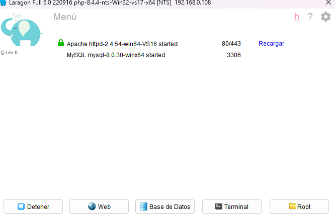
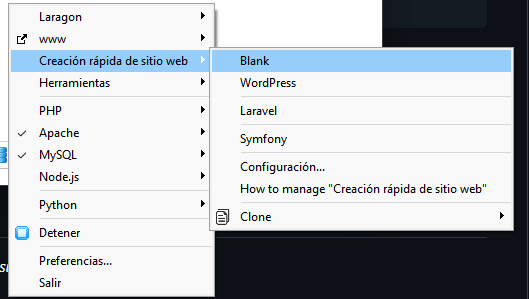
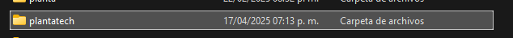

# Plantatech Cloud 

_Aplicacion web para el almacenamiento y gestion de datos obtenidos a traves de los sensores gestionados por un esp32, arduino_

## Comenzando 🚀

_Estas instrucciones te permitirán obtener una copia del proyecto en funcionamiento en tu máquina local para propósitos de desarrollo y pruebas._

Mira **Deployment** para conocer como desplegar el proyecto.


### Pre-requisitos 📋

_Para desplegar en el proyecto se necesita un servidor web local como xammp o laragon_

```
si se usa laragon crear el sitio desde creacion rapida de sitio web - Blank
```

### Instalación 🔧

_Ejecutamos nuestro servidor local en este caso laragon_



_Crear un nuevo proyecto desde la intefaz de laragon y nombramos plantatech_



_Esto nos creara un una carpeta con el nombre que hemos asignado_



_Por ultimo creamos la base de datos con el nombre_

```
gilurbina1_plantatech
```


## Ejecutando las pruebas ⚙️

_Si todo salio correctamente debemos poder acceder desde la ruta_

```
plantatech.test
```


## Construido con 🛠️

_El proyecto esta construido con boostrap y JS para la parte del frontend y PHP para backend_

* bootstrap 5
* Jquery 
* PHP 8.4.4


## Autores ✒️


* **Gilberto Urbina Larios** - *Trabajo Inicial* *Desarrollador*
* **Maria Guadalupe Chavez Cano** - *Documentación* *Desarrollador* *Pruebas*


